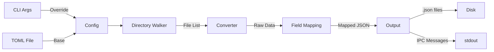

# excel-to-json — 需求规格

## 1. 功能需求

| ID | 需求 | 优先级 | 状态 |
|----|------|--------|------|
| FR-01 | 支持 .xlsx/.xls/.xlsb/.ods/.csv 文件读取 | P0 | 待实现 |
| FR-02 | 递归目录遍历（可配置开关） | P0 | 待实现 |
| FR-03 | TOML 配置文件加载 | P0 | 待实现 |
| FR-04 | 列名映射（重命名、排除） | P0 | 待实现 |
| FR-05 | 嵌套 JSON 路径映射 | P1 | 待实现 |
| FR-06 | CLI 参数覆盖配置文件 | P0 | 待实现 |
| FR-07 | stdout 行协议 IPC（进度/完成/错误） | P0 | 待实现 |
| FR-08 | stderr tracing 诊断日志 | P0 | 待实现 |
| FR-09 | 多 sheet Excel 支持 | P0 | 待实现 |
| FR-10 | Pretty-print JSON 输出选项 | P1 | 待实现 |

## 2. 非功能需求

| ID | 需求 | 指标 |
|----|------|------|
| NFR-01 | 性能 | 100MB Excel ≤10s 转换 |
| NFR-02 | 跨平台 | Linux + macOS |
| NFR-03 | 错误处理 | 所有错误可追溯，用户错误有指导 |
| NFR-04 | 代码质量 | clippy -D warnings 零容忍 |

## 3. 架构约束

- 单 crate，不拆 workspace
- 同步 I/O，不使用 async runtime
- `src/main.rs` 薄封装（≤10行），核心逻辑在 `src/lib.rs`
- 按 domain 组织模块，不按技术层
- 配置文件位于输入目录或通过 --config 指定

## 4. 数据流

---

## 变更记录

| 日期 | 版本 | 变更 |
|------|------|------|
| 2026-06-27 | 1.0 | 初始需求规格 |
